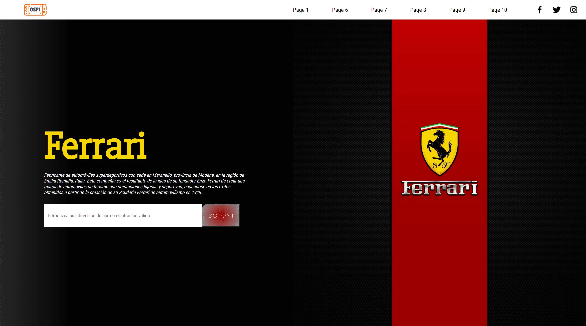

# Ferrari-SASS-Advanced-Page



Ferrari automotive brand themed web mockup. To implement **SASS** preprocessor with advanced features, conditional structures, operations, etc.

## Characteristics:

1. Making a mixin: 
```CSS
{
border-radius: 1em 0em 0;
padding: 2em;
display: flex;
justify-content: center;
align-items: center; 
}
```
to format a button. A "Placeholder" was made to format a button (Placeholder).

2. Creating a *global variable* in **SASS** called *anchoBoton(buttonWidth)*. Initialized to the value of 25px.

3. Created a *function* in a partial **SASS** file; and *imported* into the main **SASS** file, the function called: *ButtonFormat* receives as parameters a variable *$width* and three other formally declared variables of the function such as *$r, $g, $b* that match the required *RGB color* of the generated element *(the button)*.

4. Established a *@warn* with a condition, if any of the values is outside the range of [ 0 - 225] Considering that the RGB color receives this data only in that range, it should be warned in case when calling the function with such erroneous parameters the programmer can be alerted.

5. It makes sure to set some RGB color as optional arguments, in case when calling the function no such parameters are passed, ie allowing passing the parameters *$r, $g, $b* to be optional for this function.

6. Within this function an *arithmetic operation* is performed that multiplies: *$width * 5*; Then a *conditional structure* in which only if the result of the multiplication is greater than 125px execute the following instruction: *width = $width*; In addition, the *background-color* of the element is adjusted based on the colors that this function requires by parameter.

7. Created another *conditional structure* in which if the result of the multiplication is less than 100 then it emits an error message in the console indicating: *"the value of the width must be greater than 20"*.

### Technologies:
                    
|  HTML 5 |  CSS 3 |  SASS
| ------------- | ------------- | ------------- |